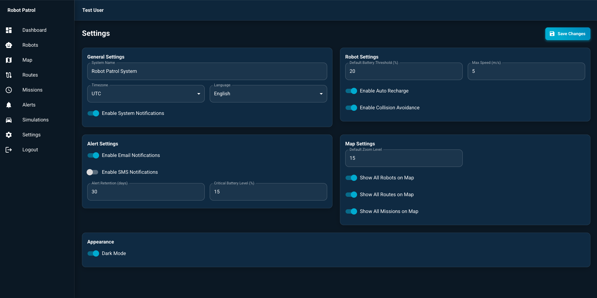
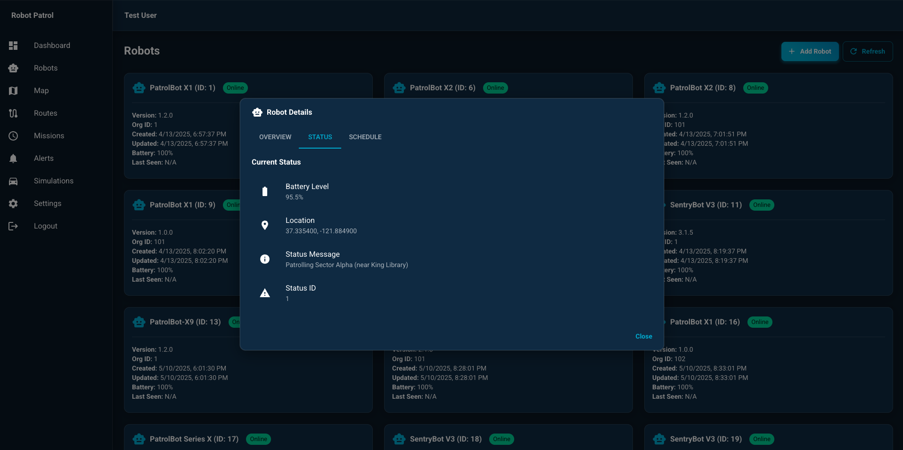
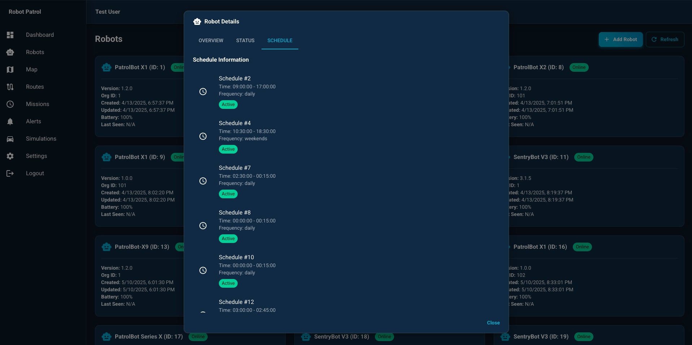
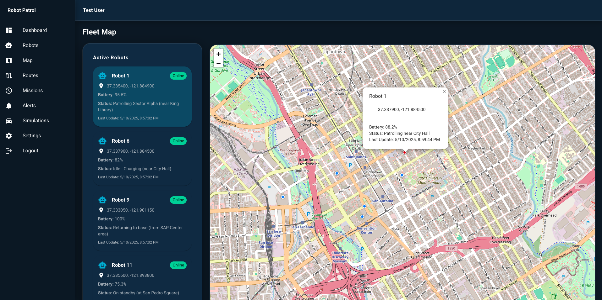
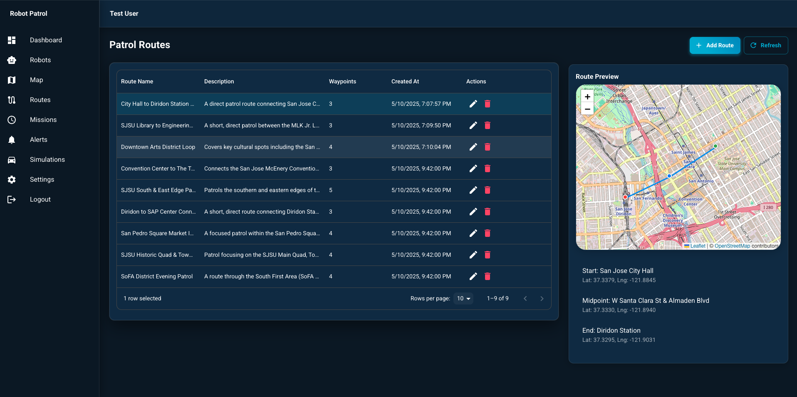
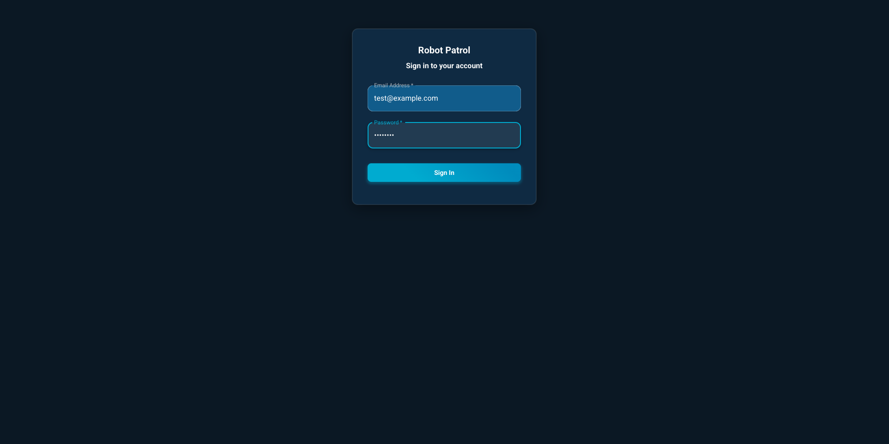
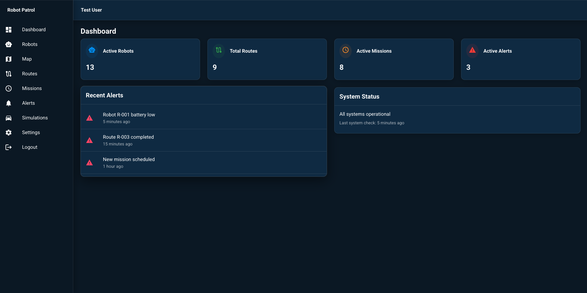

# Security Bot v1

A comprehensive security monitoring and patrol system with both frontend and backend components.

## Dahboard View

### Robot Management Interface

*Comprehensive robot fleet management dashboard showing multiple PatrolBots and SentryBots with their status, battery levels, and online/offline status. Each robot card displays crucial information including version, organization ID, creation time, and last update.*

### Robot Details & Status

*Detailed robot status panel showing:*
- Battery Level (95.5%)
- Current Location (37.335400, -121.884900)
- Status Message (Patrolling Sector Alpha near King Library)
- Status ID and other vital statistics

### Robot Schedule Management

*Robot scheduling interface displaying multiple active patrol schedules with:*
- Daily and weekend patrol times
- Schedule activation status
- Time ranges for different patrol shifts
- Frequency settings (daily/weekends)

### Fleet Map View

*Interactive map interface showing:*
- Real-time robot locations across San Jose
- Active robot status and battery levels
- Patrol areas including City Hall, SAP Center, and San Pedro Square
- Interactive markers with robot details on hover

### Patrol Routes Management

*Comprehensive route management system featuring:*
- Route listings with names and descriptions
- Waypoint counts for each route
- Creation timestamps
- Route preview map with start/end points
- Detailed route information including key landmarks

### Login Interface

*Secure login portal with:*
- Email and password authentication
- Clean, modern interface design
- Secure access to the robot patrol system

### Dashboard

*Main dashboard showing real-time security metrics and robot status*

## Project Structure

```
├── frontend/           
├── robot-patrol/       
├── routes/            
├── tests/            
└── botvenv/          
```

## Tech Stack

### Backend
- **FastAPI** - Modern, fast web framework for building APIs with Python
- **MongoDB** - NoSQL database for data storage
- **SQLAlchemy** - SQL toolkit and ORM
- **PyJWT** - JSON Web Token implementation
- **Uvicorn** - Lightning-fast ASGI server
- **Motor** - Async MongoDB driver

### Frontend
- **Express.js** - Web application framework
- **MongoDB Node.js Driver** - Database connectivity
- **dotenv** - Environment variable management

## Development Setup

### Prerequisites
- Python 3.8+
- Node.js 16+
- MongoDB
- pip (Python package manager)
- npm (Node.js package manager)

### Backend Setup

1. Create and activate virtual environment:
   ```bash
   python -m venv botvenv
   source botvenv/bin/activate  # On Unix/macOS
   # or
   .\botvenv\Scripts\activate  # On Windows
   ```

2. Install Python dependencies:
   ```bash
   pip install -r requirements.txt
   ```

3. Set up environment variables:
   Create a `.env` file in the root directory with:
   ```
   DATABASE_URL=your_mongodb_url
   JWT_SECRET=your_jwt_secret
   ```

### Frontend Setup

1. Navigate to frontend directory:
   ```bash
   cd frontend
   ```

2. Install Node.js dependencies:
   ```bash
   npm install
   ```

3. Create frontend environment variables:
   Create a `.env` file in the frontend directory with necessary configurations.

## Running the Application

### Backend
```bash
uvicorn main:app --reload
```

### Frontend
```bash
cd frontend
npm start
```

## Development Guidelines

### Code Style
- Follow PEP 8 guidelines for Python code
- Use ESLint configuration for JavaScript/Node.js code
- Maintain consistent documentation in code

### Git Workflow
1. Create feature branches from `main`
2. Use meaningful commit messages
3. Submit pull requests for review
4. Merge only after passing tests and review

### Testing
- Write unit tests for new features
- Ensure test coverage for critical components
- Run tests before committing:
  ```bash
  python -m pytest tests/
  ```

## API Documentation
- FastAPI automatic documentation available at `/docs` endpoint
- Swagger UI available at `/redoc` endpoint

## Security Considerations
- All environment variables should be properly secured
- API endpoints are protected with JWT authentication
- Database credentials must never be committed to version control
- Regular security audits are recommended

## Troubleshooting

### Common Issues
1. **Virtual Environment Issues**
   - Ensure `botvenv` is activated
   - Verify Python version compatibility

2. **Database Connection**
   - Check MongoDB service is running
   - Verify connection string in `.env`

3. **Node Modules**
   - Clear `node_modules` and reinstall if needed
   - Check for compatible package versions
